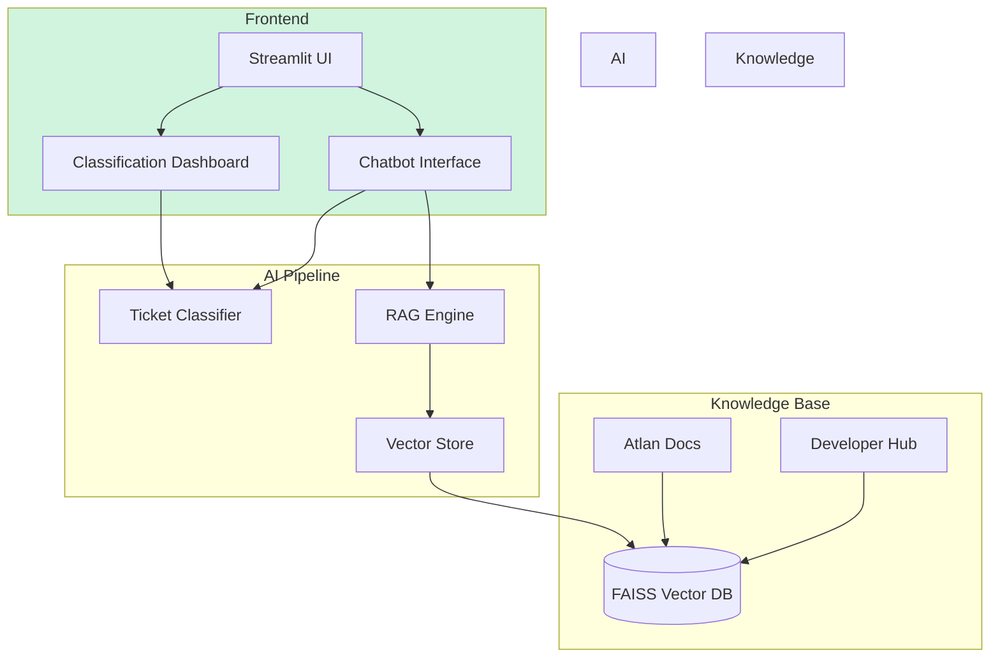
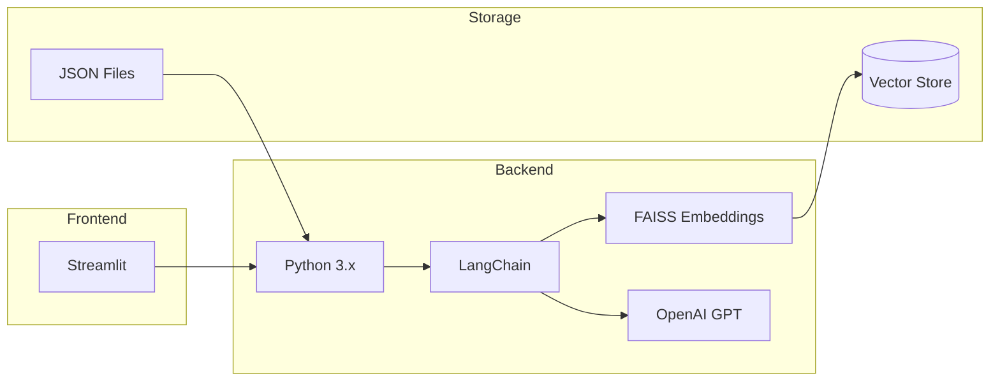
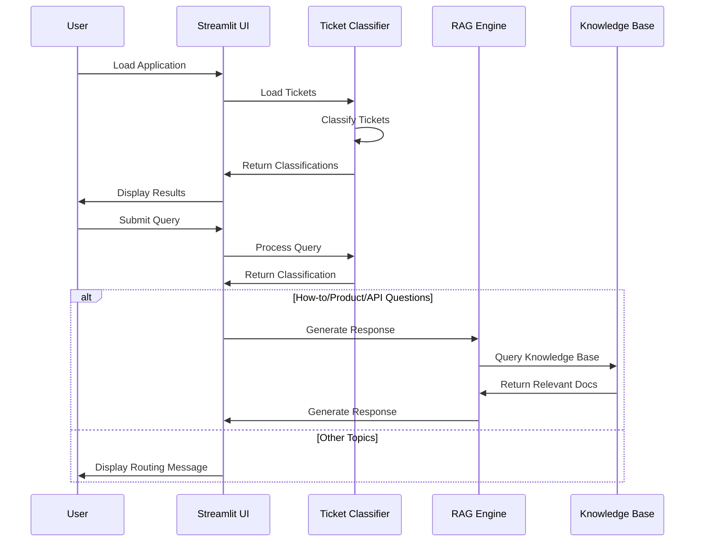

# AI-Powered Support System for Atlan

Hey there! Welcome to my Atlan assignment solution. I've built something pretty exciting here - an AI-powered support ticket system that makes life easier for Atlan's amazing support team.

## What I'm Solving

Ever wondered how support teams handle hundreds of tickets daily? At Atlan, this challenge is real. Support agents are the true heroes, helping customers with everything from "How do I do this?" to "Help! This isn't working!" 

I took on this challenge to build something that could:
- Automatically understand and sort tickets (because who likes manual sorting?)
- Draft smart responses using Atlan's documentation (because why reinvent the wheel?)
- Handle lots of tickets without breaking a sweat
- Keep the response quality top-notch

The result? A smart helpdesk that shows off what AI can do for customer support. It's not just a demo - it's a glimpse into the future of customer support!

## Architecture Diagram


## Tech Stack Flow


## Cool Features I've Built

### Smart Ticket Classification
Ever tried sorting hundreds of emails? Not fun, right? That's why I built an AI that can:
- Figure out what the ticket is about (How-to guides? Product questions? Bug reports?)
- Understand how the customer is feeling (Are they curious? Frustrated? Super angry?)
- Assign the right priority (Because not all fires are equally urgent!)

### AI-Powered Responses
This is where the magic happens! The system:
- Automatically answers common questions using Atlan's docs
- Finds the most relevant information for each question
- Shows where the information came from (because transparency matters!)

### Two Ways to Use It
I've made it super flexible:
- Got lots of tickets? Upload them all at once!
- Need to test one question? Just ask the chatbot!

## The Tech Behind the Magic

I've carefully chosen some awesome tools to build this:
- **LangChain** – Orchestrates interactions between models, tools, and data sources  
- **OpenAI GPT** – Powers advanced natural language understanding and generation  
- **FAISS** – Provides fast and scalable similarity search across embeddings  
- **HuggingFace** – Supplies state-of-the-art NLP models for text processing  
- **Streamlit** – Builds an interactive and user-friendly interface for deployment  

## Let's Get This Running!

1. Clone the repository:
```bash
git clone <repository-url>
cd atlan-support-classifier
```

2. Create and activate conda environment:
```bash
conda env create -f environment.yml
conda activate atlan-classifier
```

3. Set up environment variables in `.env`:
```plaintext
OPENAI_API_KEY=your_openai_api_key_here
```

4. Initialize FAISS vector store:
```bash
python webcrawlers/WebCrawler_1.py  # Collect documentation URLs
python create_vectorstore.py        # Create FAISS index
```

5. Run the application:
```bash
streamlit run main.py
```

## Project Structure Flow
```
Atlan_Assignment/
├── app/                      # Main application code
│   ├── ai_agent.py             # RAG and response generation
│   ├── main.py                 # Streamlit UI and routing
│   └── ticket_classifier.py     # Ticket classification logic
├── data/                     # Data storage
│   ├── tickets_data.json       # Sample support tickets
│   ├── docs_atlan_urls.json    # Documentation URLs
│   └── developer_atlan_urls.json# Developer hub URLs
├── faiss_store/             # Vector database
│   ├── index.faiss             # FAISS index file
│   └── index.pkl               # Pickle metadata
├── webcrawlers/             # Web scraping utilities
│   ├── collector.py            # URL collector
│   ├── WebCrawler_1.py        # Docs crawler
│   └── WebCrawler_2.py        # Developer hub crawler
└── requirements.txt            # Project dependencies
```

## Data Flow


## How to Use It

### Analyzing Multiple Tickets
1. Got a bunch of tickets? Just prepare them in this simple format:
```json
[
    {
        "id": "1",
        "body": "Your ticket text goes here"
    }
]
```
2. Head to the classification dashboard and upload your file
3. Watch the magic happen! You'll see all the insights roll in

### Testing Single Queries
1. Got a specific question in mind? Jump to the chatbot tab
2. Type your question and hit send
3. You'll get:
   - The AI's analysis (topic, mood, priority)
   - A helpful answer (for how-to's and product questions)
   - Links to learn more

## Want to Make It Better?

Got ideas? Awesome! Here's how you can contribute:
1. Fork it!
2. Create your feature branch: `git checkout -b feature/cool-new-thing`
3. Commit your changes: `git commit -m 'Add some coolness'`
4. Push to the branch: `git push origin feature/cool-new-thing`
5. Open a Pull Request

## License

This project is under the MIT License - feel free to use it, modify it, share it!

## Special Thanks To

Big shoutout to:
- Atlan's awesome documentation team
- The brilliant minds behind LangChain
- OpenAI for their amazing GPT models
- FAISS team at Facebook Research

---
Built with love by Shahir Shaik for Atlan
